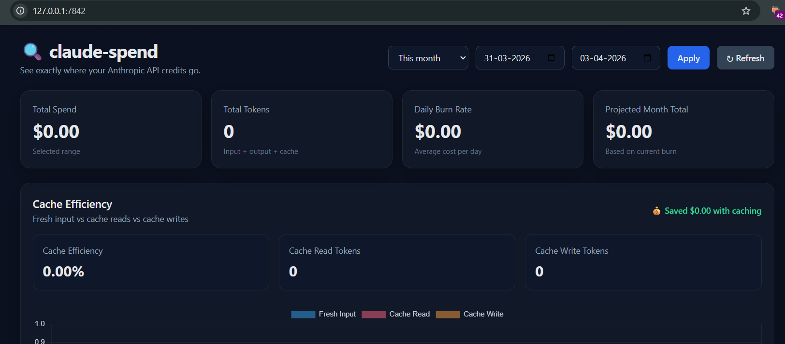

# ClaudeSpend 💸

> See exactly where your Anthropic API credits go.

**ClaudeSpend** is a free, open-source, self-hosted dashboard that connects to Anthropic's Admin APIs and gives you full visibility into your Claude API spend - broken down by model, date, workspace, and developer.



[](LICENSE)
[](https://python.org)
[](https://fastapi.tiangolo.com)

---

## Why ClaudeSpend?

The Anthropic Console shows you usage - but not *why* you're spending. ClaudeSpend answers:

- Which model is burning the most credits?
- What's my daily burn rate and projected monthly cost?
- How much am I saving (or not saving) with prompt caching?
- Which workspace or developer is spending the most?

---

## Features

- 📊 **Overview Dashboard** - total spend, tokens, burn rate, monthly projection
- 🤖 **Spend by Model** - see exactly which Claude model costs the most
- 📈 **Daily Trend** - 30-day spend chart stacked by model
- 🏢 **Workspace Breakdown** - cost per workspace/team
- 👩‍💻 **Claude Code Developer Analytics** - per-user sessions, lines of code, commits, PRs, cost
- 💾 **Cache Efficiency Panel** - how much you're saving with prompt caching
- 📤 **Export** - download full data as CSV or JSON
- 🔄 **Auto-refresh** - stays current without manual refresh
- 🌙 **Dark mode** - easy on the eyes

---

## Quick Start

```bash
# 1. Clone the repo
git clone https://github.com/Hoppiplus/ClaudeSpend.git
cd ClaudeSpend

# 2. Create a virtual environment
python3 -m venv .venv
source .venv/bin/activate      # Mac/Linux
# .venv\Scripts\activate       # Windows

# 3. Install
pip install -e .

# 4. Add your Admin API key
cp .env.example .env
# Edit .env and paste your key

# 5. Launch
claude-spend
```

Dashboard opens automatically at **http://127.0.0.1:7842**

---

## Getting Your Admin API Key

ClaudeSpend requires an **Admin API key** - this is different from a standard API key.

1. Go to [console.anthropic.com](https://console.anthropic.com)
2. Navigate to **Settings → Admin Keys**
3. Click **Create Admin Key**
4. Copy the key (starts with `sk-ant-admin...`)
5. Paste it into your `.env` file

> ⚠️ The Admin API is only available for **organization accounts**. If you're on an individual account, go to **Settings → Organization** to set one up first.

---

## CLI Reference

```bash
claude-spend                          # Launch dashboard (default)
claude-spend --port 8080              # Custom port
claude-spend --summary                # Print summary in terminal, no browser
claude-spend --export csv --output report.csv   # Export to CSV
claude-spend --export json --output report.json # Export to JSON
claude-spend --set-key sk-ant-admin-... # Save API key
```

---

## FAQ

**Why do I need an Admin API key?**
Standard API keys only work for making Claude API calls. The Admin API key gives read access to your organization's usage and cost data.

**Is my API key stored securely?**
Yes - your key is stored only in your local `.env` file. It never leaves your machine except when making requests directly to Anthropic's API.

**How often does data refresh?**
Data auto-refreshes every 5 minutes. Anthropic's usage data has up to a 5-minute delay. Claude Code analytics have up to a 1-hour delay.

**Does this work with AWS Bedrock or Google Vertex AI?**
No - ClaudeSpend uses Anthropic's 1st-party Admin API, which only covers direct Anthropic API usage.

**I'm on an individual account, can I still use this?**
The Admin API requires an organization account. Set one up at Console → Settings → Organization (it's free).

---

## Tech Stack

- **Backend:** Python + FastAPI
- **Frontend:** Single-file HTML with vanilla JS + Chart.js (no build step)
- **Cache:** SQLite (local, no external DB needed)
- **Install:** `pip install -e .` and you're done

---

## Contributing

Contributions welcome! Please open an issue first to discuss what you'd like to change.

1. Fork the repo
2. Create a feature branch (`git checkout -b feature/my-feature`)
3. Commit your changes
4. Open a Pull Request

---

## License

MIT - free to use, modify, and distribute.

---

*Built because we got tired of not knowing where our Claude credits were going.*
